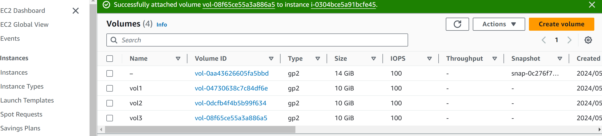
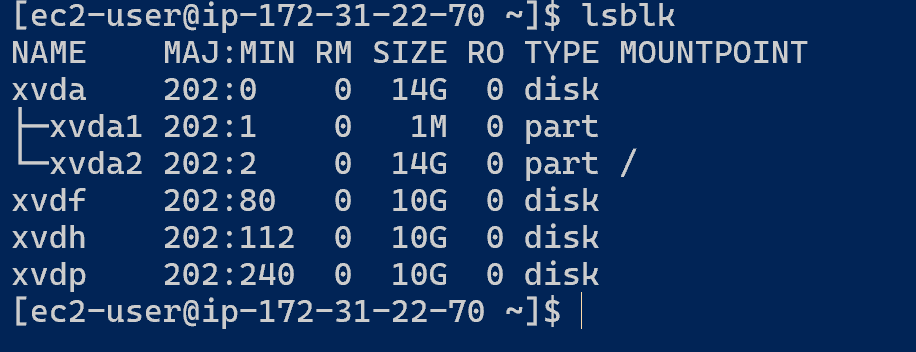
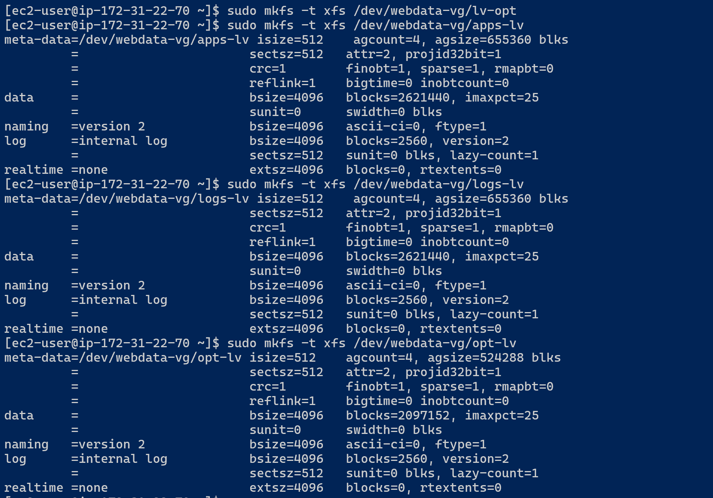
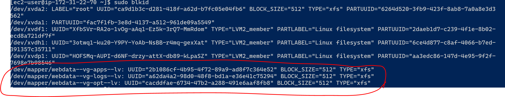

# DEVOPS TOOLING WEBSITE SOLUTION

## `Introduction`

- The DevOps Tooling Website Solution refers to a suite of integrated tools and practices designed to streamline and automate the development, deployment, and management of web applications. This solution embodies the principles of DevOps, which aims to enhance collaboration between development and operations teams, improve the efficiency of workflows, and ensure the reliability and scalability of applications.
- DevOps Tooling Website Solution leverages a combination of tools and practices to automate and optimize the entire lifecycle of web applications. From code development to deployment and monitoring, it ensures a seamless, efficient, and reliable process.

### Key Components and Tools

1. Version Control System (VCS)

    Git/GitHub/GitLab: These are used to manage and track changes in the source code, enabling multiple developers to collaborate efficiently.

2. Continuous Integration/Continuous Deployment (CI/CD)

    Jenkins/GitLab CI/Travis CI: CI/CD tools automate the process of building, testing, and deploying code. They ensure that new code changes are continuously integrated and deployed to production with minimal manual intervention.

3. Configuration Management

    Ansible/Chef/Puppet: These tools automate the provisioning and management of infrastructure. They ensure that systems are configured consistently and can be replicated easily across different environments.

4. Infrastructure as Code (IaC)

    Terraform/CloudFormation: IaC tools allow infrastructure to be defined and managed using code, making it easy to provision and scale resources in a repeatable manner.

5. Containerization

    Docker: Docker packages applications and their dependencies into containers, ensuring that they run consistently across different environments.

6. Container Orchestration

    Kubernetes/Docker Swarm: These platforms manage the deployment, scaling, and operation of containerized applications across clusters of machines.

7. Monitoring and Logging

    Prometheus/Grafana/ELK Stack (Elasticsearch, Logstash, Kibana): Monitoring tools collect metrics and logs from applications and infrastructure, providing visibility into system performance and helping to identify issues.

In this project you will implement a solution that consists of following components:


### Importance of Devops tooling website solution

- Automation: Reduces manual tasks and errors, leading to faster and more reliable deployments.

- Consistency: Ensures that environments are identical, reducing the likelihood of environment-specific issues.

- Scalability: Easily scale applications and infrastructure to meet demand.

- Efficiency: Streamlines development and deployment processes, allowing teams to focus on delivering features and improvements.

- Reliability: Continuous monitoring and automated testing help catch and resolve issues early, improving    system stability.

## Implementing A Tooling Website

STEP 1 – PREPARE NFS SERVER
1. Spin up a new EC2 instance with RHEL Linux 8 Operating System.


2. Based on your LVM experience from Project 6, Configure LVM on the Server.
- create volumes for the NFS server






using the gdisk utility to create partitions


- Once partition is created install lvm2 using sudo yum install lvm2 then carry out the other process as in the previous project.

- Create physical volume and volume group. Refer to the previous project for this.

- Use lvcreate to create logical volumes of size 10G, 10G and 8G each.

- Instead of formating the disks as ext4 you will have to format them as xfs
`
sudo mkfs -t xfs /dev/webdata-vg/lv-apps
sudo mkfs -t xfs /dev/webdata-vg/lv-logs
sudo mkfs -t xfs /dev/webdata-vg/lv-opt
`




- Ensure there are 3 Logical Volumes. lv-opt lv-apps, and lv-logs

3. Create mount points on /mnt directory for the logical volumes as follow:

Mount lv-apps on /mnt/apps – To be used by webservers

Mount lv-logs on /mnt/logs – To be used by webserver logs

Mount lv-opt on /mnt/opt – To be used by Jenkins server in Project 8

```
sudo mkdir /mnt/apps

sudo mkdir /mnt/logs

sudo mkdir /mnt/opt

sudo mount /dev/webdata-vg/lv-apps /mnt/apps

sudo mount /dev/webdata-vg/lv-logs /mnt/logs

sudo mount /dev/webdata-vg/lv-opt /mnt/opt
```

- Once mount is completed run sudo blkid to get the UUID of the mount part, open and paste the UUID in the fstab file.



Edit fstab file and paste the UUID of the mount part

      sudo vi /etc/fstab
    ```
    sudo mount -a 
    sudo systemctl daemon-reload
    ```

4. Install NFS server, configure it to start on reboot and make sure it is u and running
```
sudo yum -y update

sudo yum install nfs-utils -y

sudo systemctl start nfs-server.service

sudo systemctl enable nfs-server.service

sudo systemctl status nfs-server.service
```

