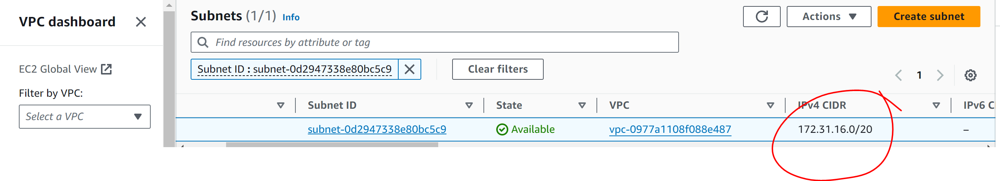
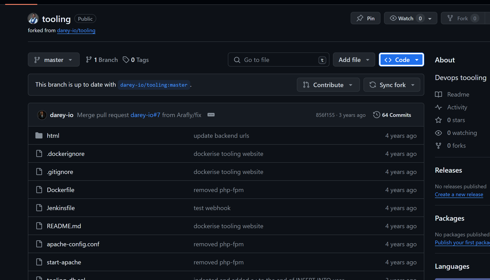
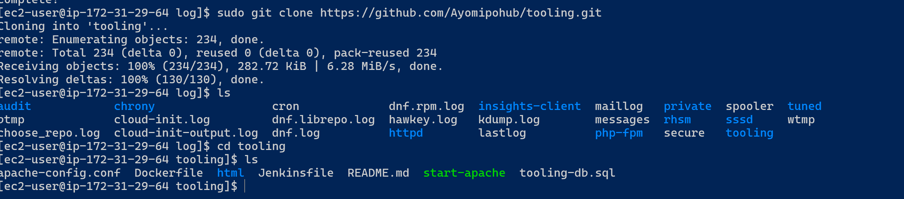
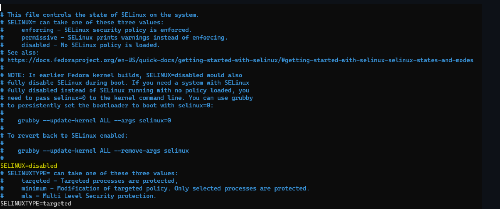

# DEVOPS TOOLING WEBSITE SOLUTION

## `Introduction`

- The DevOps Tooling Website Solution refers to a suite of integrated tools and practices designed to streamline and automate the development, deployment, and management of web applications. This solution embodies the principles of DevOps, which aims to enhance collaboration between development and operations teams, improve the efficiency of workflows, and ensure the reliability and scalability of applications.
- DevOps Tooling Website Solution leverages a combination of tools and practices to automate and optimize the entire lifecycle of web applications. From code development to deployment and monitoring, it ensures a seamless, efficient, and reliable process.

### Key Components and Tools

1. Version Control System (VCS)

    Git/GitHub/GitLab: These are used to manage and track changes in the source code, enabling multiple developers to collaborate efficiently.

2. Continuous Integration/Continuous Deployment (CI/CD)

    Jenkins/GitLab CI/Travis CI: CI/CD tools automate the process of building, testing, and deploying code. They ensure that new code changes are continuously integrated and deployed to production with minimal manual intervention.

3. Configuration Management

    Ansible/Chef/Puppet: These tools automate the provisioning and management of infrastructure. They ensure that systems are configured consistently and can be replicated easily across different environments.

4. Infrastructure as Code (IaC)

    Terraform/CloudFormation: IaC tools allow infrastructure to be defined and managed using code, making it easy to provision and scale resources in a repeatable manner.

5. Containerization

    Docker: Docker packages applications and their dependencies into containers, ensuring that they run consistently across different environments.

6. Container Orchestration

    Kubernetes/Docker Swarm: These platforms manage the deployment, scaling, and operation of containerized applications across clusters of machines.

7. Monitoring and Logging

    Prometheus/Grafana/ELK Stack (Elasticsearch, Logstash, Kibana): Monitoring tools collect metrics and logs from applications and infrastructure, providing visibility into system performance and helping to identify issues.

In this project you will implement a solution that consists of following components:


### Importance of Devops tooling website solution

- Automation: Reduces manual tasks and errors, leading to faster and more reliable deployments.

- Consistency: Ensures that environments are identical, reducing the likelihood of environment-specific issues.

- Scalability: Easily scale applications and infrastructure to meet demand.

- Efficiency: Streamlines development and deployment processes, allowing teams to focus on delivering features and improvements.

- Reliability: Continuous monitoring and automated testing help catch and resolve issues early, improving    system stability.

## Implementing A Tooling Website

STEP 1 – PREPARE NFS SERVER
1. Spin up a new EC2 instance with RHEL Linux 8 Operating System.


2. Based on your LVM experience from Project 6, Configure LVM on the Server.
- create volumes for the NFS server


using the gdisk utility to create partitions


- Once partition is created install lvm2 using sudo yum install lvm2 then carry out the other process as in the previous project.

- Create physical volume and volume group. Refer to the previous project for this.

- Use lvcreate to create logical volumes of size 10G, 10G and 8G each.

- Instead of formating the disks as ext4 you will have to format them as xfs
`
sudo mkfs -t xfs /dev/webdata-vg/lv-apps
sudo mkfs -t xfs /dev/webdata-vg/lv-logs
sudo mkfs -t xfs /dev/webdata-vg/lv-opt
`


- Ensure there are 3 Logical Volumes. lv-opt lv-apps, and lv-logs

3. Create mount points on /mnt directory for the logical volumes as follow:

Mount lv-apps on /mnt/apps – To be used by webservers

Mount lv-logs on /mnt/logs – To be used by webserver logs

Mount lv-opt on /mnt/opt – To be used by Jenkins server in Project 8

```
sudo mkdir /mnt/apps

sudo mkdir /mnt/logs

sudo mkdir /mnt/opt

sudo mount /dev/webdata-vg/lv-apps /mnt/apps

sudo mount /dev/webdata-vg/lv-logs /mnt/logs

sudo mount /dev/webdata-vg/lv-opt /mnt/opt
```

- Once mount is completed run sudo blkid to get the UUID of the mount part, open and paste the UUID in the fstab file.


Edit fstab file and paste the UUID of the mount part

      sudo vi /etc/fstab
    ```
    sudo mount -a 
    sudo systemctl daemon-reload
    ```

4. Install NFS server, configure it to start on reboot and make sure it is u and running
```
sudo yum -y update

sudo yum install nfs-utils -y

sudo systemctl start nfs-server.service

sudo systemctl enable nfs-server.service

sudo systemctl status nfs-server.service
```


5. Export the mounts for webservers’ subnet cidr to connect as clients. For simplicity, you will install your all three Web Servers inside the same subnet, but in production set up you would probably want to separate each tier inside its own subnet for higher level of security. To check your subnet cidr – open your EC2 details in AWS web console and locate ‘Networking’ tab and open a Subnet link:



- Make sure we set up permission that will allow our Web servers to read, write and execute files on NFS:
```
sudo chown -R nobody: /mnt/apps

sudo chown -R nobody: /mnt/logs

sudo chown -R nobody: /mnt/opt

sudo chmod -R 777 /mnt/apps

sudo chmod -R 777 /mnt/logs

sudo chmod -R 777 /mnt/opt

sudo systemctl restart nfs-server.service
```

- Configure access to NFS for clients within the same subnet (example of Subnet CIDR – 172.31.32.0/20):
```
sudo nano /etc/exports

/mnt/apps 172.31.32.0/20(rw,sync,no_all_squash,no_root_squash)
/mnt/logs 172.31.32.0/20(rw,sync,no_all_squash,no_root_squash)
/mnt/opt 172.31.32.0/20(rw,sync,no_all_squash,no_root_squash)
```
Save and close the file.

sudo exportfs -arv


6. Check which port is used by NFS and open it using Security Groups (add new Inbound Rule)

 rpcinfo -p | grep nfs

 

Important note: In order for NFS server to be accessible from your client, you must also open following ports: TCP 111, UDP 111, UDP 2049


STEP 2 – CONFIGURE THE DATABASE SERVER
1. Install MySQL server

 sudo apt install mysql

2. Create a database and name it tooling
```
 sudo mysql
 create database tooling;
```

3. Create a database user and name it webaccess

`create user 'webaccess'@'172.31.32.0/20' identified by 'mypasskey';`

4. Grant permission to webaccess user on tooling database to do anything only from the webservers subnet cidr

`grant all privileges on tooling.* to 'webaccess'@'172.31.80.0/20';`


STEP 3 - PREPARE THE WEB SERVERS
During the next steps we will do following:

- Configure NFS client (this step must be done on all three servers)

- Deploy a Tooling application to our Web Servers into a shared NFS folder

- Configure the Web Servers to work with a single MySQL database

1. Launch three new EC2 instance with RHEL 8 Operating System

2. Install NFS client

sudo yum install nfs-utils nfs4-acl-tools -y


3. Mount /var/www/ and target the NFS server’s export for apps
```
sudo mkdir /var/www
sudo mount -t nfs -o rw,nosuid <NFS-Server-Private-IP-Address>:/mnt/apps /var/www
```

4. Verify that NFS was mounted successfully by running df -h. Make sure that the changes will persist on Web Server after reboot:

sudo nano /etc/fstab

add following line;

<NFS-Server-Private-IP-Address>:/mnt/apps /var/www nfs defaults 0 0


5. Install Remi’s repository, Apache and PHP
```
sudo yum install httpd -y

sudo yum install https://dl.fedoraproject.org/pub/epel/epel-release-latest-8.noarch.rpm

sudo yum install dnf-utils http://rpms.remirepo.net/enterprise/remi-release-8.rpm

sudo yum module  list php -y

sudo yum module reset php -y

sudo yum module enable php:remi-7.4 -y

sudo yum install php php-opcache php-gd php-curl php-mysqlnd -y

sudo systemctl start php-fpm

sudo systemctl enable php-fpm

sudo setsebool -P httpd_execmem 1

sudo systemctl restart httpd
```

steps 1-5 for should be done for webserver 1, 2 and 3

6. Verify that Apache files and directories are available on the Web Server in /var/www and also on the NFS server in /mnt/apps. If you see the same files – it means NFS is mounted correctly. You can try to create a new file touch test.txt from one server and check if the same file is accessible from other Web Servers.

7. Locate the log folder for Apache on the Web Server and mount it to NFS server’s export for logs. Repeat step 4 under the 'prepare web servers' to make sure the mount point will persist after reboot.

8. Fork the tooling source code from Darey.io Github Account to your Github account.



9. Deploy the tooling website’s code to the Webserver. Ensure that the html folder from the repository is deployed to /var/www/html



10. Copy all content inside the html folder into /var/www/html.

sudo cp -R html/. /var/www/html

Note 1: Do not forget to open TCP port 80 on the Web Server.

Note 2: If you encounter 403 Error – check permissions to your /var/www/html folder and also disable SELinux sudo setenforce 0

To make this change permanent – open following config file sudo vi /etc/sysconfig/selinux and set SELINUX=disabled then restart httpd.




