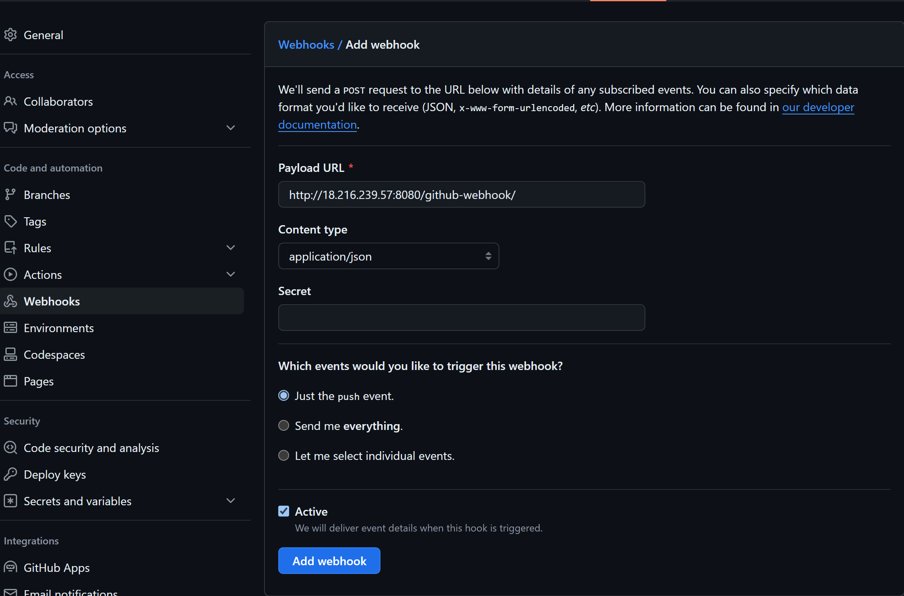
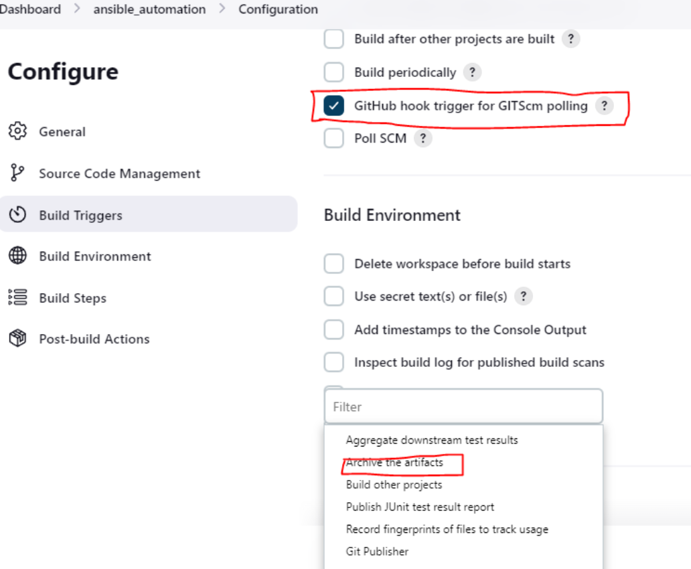
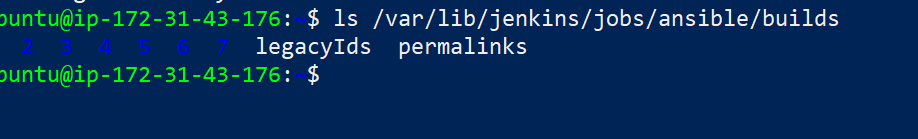
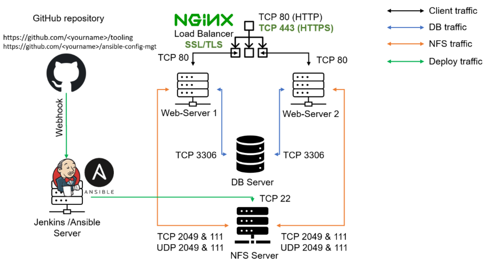

# ANSIBLE AUTOMATE PROJECT

## Introduction To Ansible

Ansible is an open-source automation tool used for configuration management, application deployment, and task automation. Developed by Red Hat, it aims to simplify complex tasks and make them repeatable and manageable. Here are the key points to understand Ansible:

### Key Features of Ansible:

1. Agentless: Ansible does not require any agent software to be installed on the target machines. It communicates over SSH or Windows Remote Management (WinRM).

2. Simple and Human-readable: Ansible uses YAML (Yet Another Markup Language) for its configuration files, known as playbooks, making them easy to read and write.

3. Idempotent: Ansible ensures that operations are performed only if the system state changes are necessary, preventing redundant actions.

4. Extensible: Ansible can be extended with custom modules, plugins, and inventory sources to fit specific needs.

### Components of Ansible:

1. Modules: Reusable, standalone scripts that perform specific tasks (e.g., managing packages, users, or services).

2. Playbooks: YAML files that define a series of tasks to be executed on remote systems. Playbooks are the heart of Ansible's configuration management.

3. Inventory: A list of hosts (nodes) to be managed, which can be static or dynamically generated.

4. Roles: A way to organize playbooks and tasks into reusable units, making complex playbooks easier to manage.

### Basic Workflow:

1. Define Inventory: Create an inventory file listing the servers and their groups.

2. Write Playbooks: Write YAML-based playbooks describing the desired state and tasks to be performed.

3. Execute Playbooks: Use the ansible-playbook command to apply the playbook to the target inventory.


## Ansible Client as a Jump Server (Bastion Host)

A Jump Server (sometimes also referred as Bastion Host) is an intermediary server through which access to internal network can be provided. If you think about the current architecture you are working on, ideally, the webservers would be inside a secured network which cannot be reached directly from the Internet. That means, even DevOps engineers cannot SSH into the Web servers directly and can only access it through a Jump Server – it provide better security and reduces attack surface.

On the diagram below the Virtual Private Network (VPC) is divided into two subnets – Public subnet has public IP addresses and Private subnet is only reachable by private IP addresses


### General importance:

1. Configuration Management: Ensuring that servers are configured correctly with desired settings and software.

2. Application Deployment: Automating the deployment of applications across multiple servers.
3. Task Automation: Automating repetitive administrative tasks, such as backups or user management.
4. Continuous Delivery and Integration: Integrating with CI/CD pipelines to automate the build, test, and deployment processes.


## Implementing Ansible For Automation

Step 1: Install and Configure Ansible on EC2 Instance
- Launch an instace and name it Jenkins-Ansible. We will install and configure jenkins and ansible on this instance.

- Create a new repository call ansible-config-mgt. This repository will be connected to jenkins pipeline and also store ansible files

- Install Ansible

```  
sudo apt update
sudo apt install ansible
```

*Confirm Ansible has been successfully installed*

ansible --version


step 2: Configure Jenkins Build Job To Archive Your Repository Content Every Time It Is Changed
Jenkin is a pipeline for continuous integration. To create a build job, we need to have jenkins installed and configured first.

- On the same EC2 instance ansible was installed, we need to install jenkins *** Update package repositories

sudo apt update


- Install JDK

sudo apt install default-jdk-headless

- Install Jenkins

```
wget -q -O - https://pkg.jenkins.io/debian-stable/jenkins.io.key | sudo apt-key add -
sudo sh -c 'echo deb https://pkg.jenkins.io/debian-stable binary/ > \
/etc/apt/sources.list.d/jenkins.list'
sudo apt update
sudo apt-get install jenkins
```

Check if jenkins has been installed, and it is up and running

sudo systemctl status jenkins


- On our Jenkins-Ansible instance, create new inbound rules for port 8080 in security group


### Set up Jenkins

i. Input your Jenkins-Ansible Instance ip address on your web browser i.e. http://public_ip_address:8080

ii. On your Jenkins-Ansible instance, check "/var/lib/jenkins/secrets/initialAdminPassword" to know your password.


iii. Installed suggested plugins

iv. Create a user account

v. Log in to jenkins console


## Confiure Jenkins To Receive Source Code From ansible-cofig-mgt

i. Allow webhook in our github repository. In ansible-config-mgt repository, navigate to settings>webhooks and past the url of jenkins.




ii. Create a freestyle project in your jenkins web account and name it "ansible_automation"

iii. Connect jenkins to ansible-config-mgt repository by pasting the repository url in the area selected below


v. Save configuration and run "build now" to connect jenkins to our repository


v. Click "Configure" your job and add these two configurations

Configure triggering the job from GitHub webhook and Configure "Post-build Actions" to archive all the files. 



click on add post-build actions and click "Archive the Artifact" then save

Now, go ahead and make some change in any file in your GitHub repository (e.g. README.MD file) and push the changes to the master branch.

You will see that a new build has been launched automatically (by webhook) and you can see its results – artifacts, saved on Jenkins server.


vi. Test your setup by making some change in README.MD file in master branch and make sure that builds starts automatically and Jenkins saves the files (build artifacts) in following folder

ls /var/lib/jenkins/jobs/ansible/builds/<build_number>/archive/



Note: Trigger Jenkins project execution only for /main (main) branch.

Now your setup will look like this:



Tip: Every time you stop/start your Jenkins-Ansible server – you have to reconfigure GitHub webhook to a new IP address, in order to avoid it, it makes sense to allocate an Elastic IP to your Jenkins-Ansible server (you have done it before to your LB server in Project 10). Note that Elastic IP is free only when it is being allocated to an EC2 Instance, so do not forget to release Elastic IP once you terminate your EC2 Instance.


