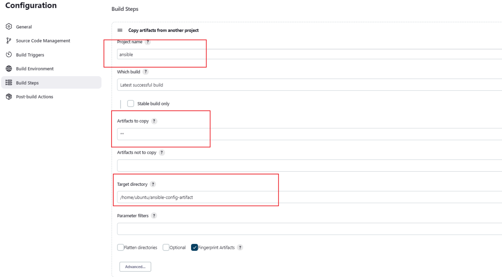
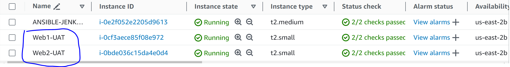
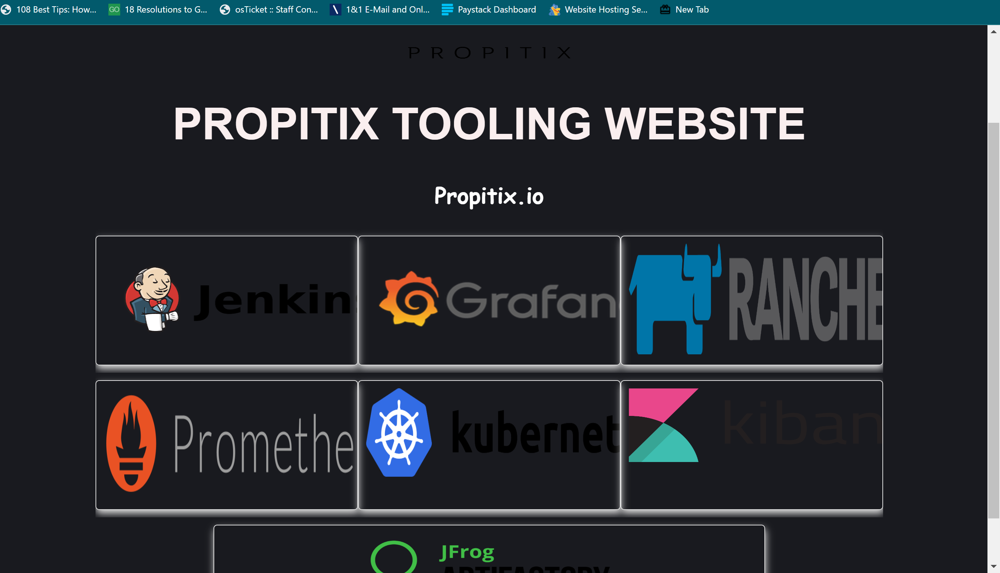
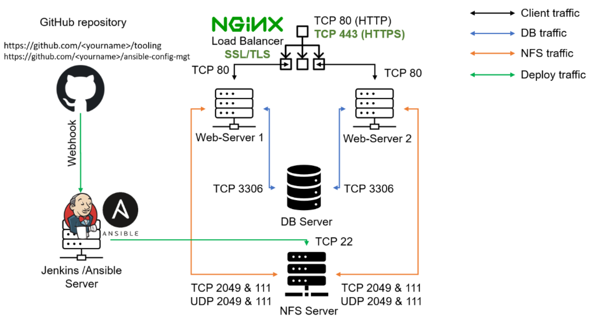

# ANSIBLE REFACTORING, ASSIGNMENTS AND IMPORTS

## Introduction 

### Refactoring in Ansible
Refactoring in Ansible involves restructuring your playbooks, roles, and tasks to improve their readability, maintainability, and efficiency without changing their functionality. This can include breaking down complex playbooks into smaller, reusable components, simplifying tasks, and improving variable management.

- Common refactoring techniques in Ansible:

1. Splitting Playbooks: Breaking a large playbook into smaller, more manageable playbooks.
2. Using Roles: Organizing tasks into roles to promote reuse and modularity.
3. Variable Consolidation: Centralizing variables in a vars file or in group/host variable files.
4. Task Optimization: Combining similar tasks, removing redundant tasks, and using loops.

Example before refactoring:

```
- hosts: webservers
  tasks:
    - name: Install Nginx
      apt:
        name: nginx
        state: present

    - name: Start Nginx
      service:
        name: nginx
        state: started
```

### Assignment in Ansible
Assignment in Ansible refers to setting values to variables, which can be used to store data such as configuration parameters, credentials, or dynamic values that can be reused throughout playbooks and roles.

- Methods of assignment in Ansible:

1. Direct Assignment: Assigning variables directly within a playbook or task.
2. Using vars Files: Storing variables in separate files and including them in playbooks.
3. Group/Host Variables: Defining variables specific to groups of hosts or individual hosts in inventory files.

Example:
```
# Direct Assignment
- hosts: webservers
  vars:
    nginx_package: nginx
  tasks:
    - name: Install Nginx
      apt:
        name: "{{ nginx_package }}"
        state: present

# Using `vars` File
# vars/nginx.yml
nginx_package: nginx

# Playbook
- hosts: webservers
  vars_files:
    - vars/nginx.yml
  tasks:
    - name: Install Nginx
      apt:
        name: "{{ nginx_package }}"
        state: present
```

### Import in Ansible
Importing in Ansible is used to include tasks, playbooks, or roles into other playbooks, allowing for better organization and reuse of code. There are two main directives for this purpose: import_tasks, import_playbook, and import_role.

Examples:

```
# Importing Tasks
- hosts: webservers
  tasks:
    - import_tasks: tasks/nginx_install.yml

# tasks/nginx_install.yml
- name: Install Nginx
  apt:
    name: nginx
    state: present

# Importing Playbooks
# main_playbook.yml
- import_playbook: webservers.yml
- import_playbook: databases.yml

# Importing Roles
- hosts: webservers
  tasks:
    - import_role:
        name: nginx
```

### Importance Of Refactoring, Assignment And Imports
Effective Ansible usage is critical for organizations aiming to automate infrastructure management and application deployment. Refactoring promotes code clarity, reducing errors and easing collaboration. Assignments empower playbooks with dynamic capabilities, adapting to diverse scenarios. Imports enable the reuse of well-defined components, fostering modularity and scalability. Mastery of these concepts enhances productivity, making Ansible an indispensable asset in the DevOps toolbox.

## Refactor Ansible Code By Importing Other Playbooks Into site.yml
Step 1: Jenkins Job Enhancement
In the previous project, we create a jenkins build job, let us make some changes to our Jenkins job. Now every new change in the codes creates a separate directory which is not very convenient when we want to run some commands from one place. Besides, it consumes space on Jenkins server with each subsequent change. Let us enhance it by introducing a new Jenkins job - we will require Copy Artifact plugin.

i. Go to your Jenkins-Ansible server and create a new directory called ansible-config-artifact - we will store there all artifacts after each build.

sudo mkdir /home/ubuntu/ansible-config-artifact

ii. Change permissions to this directory, so Jenkins could save files there.

chmod -R 0777 /home/ubuntu/ansible-config-artifact


iii. Go to Jenkins web console -> Manage Jenkins -> Manage Plugins -> on Available tab search for Copy Artifact and install this plugin without restarting Jenkins.


iv. Create a new Freestyle project as it was done in the previous project and name it save_artifacts. Make sure it is connected to ansible-config-mgt repository.


v. This project will be triggered by completion of your existing ansible project. Configure it accordingly


Note: You can configure number of builds to keep in order to save space on the server, for example, you might want to keep only last 2 or 5 build results. You can also make this change to your ansible job.

vi. The main idea of save_artifacts project is to save artifacts into /home/ubuntu/ansible-config-artifact directory. To achieve this, create a Build step and choose Copy artifacts from other project, specify ansible as a source project and /home/ubuntu/ansible-config-artifact as a target directory.




vii. Test your set up by making some change in README.MD file inside your ansible-config-mgt repository (right inside master branch).

If both Jenkins jobs have completed one after another – you shall see your files inside /home/ubuntu/ansible-config-artifact directory and it will be updated with every commit to your master branch.


## REFACTOR ANSIBLE CODE BY IMPORTING OTHER PLAYBOOKS INTO SITE.YML

### Step 2 – Refactor Ansible code by importing other playbooks into site.yml
Before starting to refactor any codes, ensure that you have pulled down the latest code from master (main) branch, and created a new branch, name it refactor.

1. Within playbooks folder, create a new file and name it site.yml – This file will now be considered as an entry point into the entire infrastructure configuration. Other playbooks will be included here as a reference. In other words, site.yml will become a parent to all other playbooks that will be developed. Including common.yml that you created previously.

2. Create a new folder in root of the repository and name it static-assignments. The static-assignments folder is where all other children playbooks will be stored. This is merely for easy organization of your work. It is not an Ansible specific concept, therefore you can choose how you want to organize your work. You will see why the folder name has a prefix of static very soon. For now, just follow along.

3. Move common.yml file into the newly created static-assignments folder.

4. Inside site.yml file, import common.yml playbook.

```
---
- hosts: all
- import_playbook: ../static-assignments/common.yml
```

The code above uses built in import_playbook Ansible module.

The folder structure looks like this;


5. Since i need to apply some tasks to your dev servers and wireshark is already installed – i can go ahead and create another playbook under static-assignments and name it common-del.yml. In this playbook, configure deletion of wireshark utility.

```
---
- name: update web and nfs servers
  hosts: webservers and nfs
  remote_user: ec2-user
  become: yes
  become_user: root
  tasks:
  - name: delete wireshark
    yum:
      name: wireshark
      state: removed

- name: update LB and DB servers
  hosts: lb, db 
  remote_user: ubuntu
  become: yes
  become_user: root
  tasks:
  - name: delete wireshark
    apt:
      name: wireshark-qt
      state: absent
      autoremove: yes
      purge: yes
      autoclean: yes
```

update site.yml with - import_playbook: ../static-assignments/common-del.yml instead of common.yml and run it against dev servers:

SSH into the jenkins-ansible server and run the playbook and inventory file

ansible-playbook -i /home/ubuntu/ansible-config-artifact/inventory/dev.yml /home/ubuntu/ansible-config-artifact/playbooks/site.yml 


Make sure that wireshark is deleted on all the servers by running wireshark --version


## CONFIGURE UAT WEBSERVERS WITH A ROLE ‘WEBSERVER’

### Step 3 – Configure UAT Webservers with a role ‘Webserver’

1. Launch 2 fresh EC2 instances using RHEL 8 image, we will use them as our uat servers, so give them names accordingly – Web1-UAT and Web2-UAT.



2. To create a role, you must create a directory called roles/, relative to the playbook file or in /etc/ansible/ directory.

- Create the directory/files structure manually


3. Update your inventory ansible-config-mgt/inventory/uat.yml file with IP addresses of your 2 UAT Web servers

```
[uat-webservers]
<Web1-UAT-Server-Private-IP-Address> ansible_ssh_user='ec2-user' 

<Web2-UAT-Server-Private-IP-Address> ansible_ssh_user='ec2-user' 
```

4. In /etc/ansible/ansible.cfg file uncomment roles_path string and provide a full path to your roles directory roles_path    = /home/ubuntu/ansible-config-mgt/roles, so Ansible could know where to find configured roles.

5. It is time to start adding some logic to the webserver role. Go into tasks directory, and within the main.yml file, start writing configuration tasks to do the following:

- Install and configure Apache (httpd service)
- Clone Tooling website from GitHub https://github.com/<your-name>/tooling.git.
- Ensure the tooling website code is deployed to /var/www/html on each of 2 UAT Web servers.
- Make sure httpd service is started

Your main.yml may consist of following tasks:

```
---
- name: Install apache
  become: true
  ansible.builtin.yum:
    name: "httpd"
    state: present

- name: Install git
  become: true
  ansible.builtin.yum:
    name: "git"
    state: present

- name: clone a repo
  become: true
  ansible.builtin.git:
    repo: https://github.com/Tonybesto/tooling.git
    dest: /var/www/html
    force: yes

- name: copy html content to one level up
  become: true
  command: cp -r /var/www/html /var/www/

- name: Start service httpd, if not started
  become: true
  ansible.builtin.service:
    name: httpd
    state: started

- name: recursively remove /var/www/html directory
  become: true
  ansible.builtin.file:
  path: /var/www/html
  state: absent
  ```

## REFERENCE WEBSERVER ROLE

### Step 4 – Reference ‘Webserver’ role

Within the static-assignments folder, create a new assignment for uat-webservers uat-webservers.yml. This is where you will reference the role.

```
---
- hosts: uat-webservers
  roles:
     - webserver
```

Remember that the entry point to our ansible configuration is the site.yml file. Therefore, you need to refer your uat-webservers.yml role inside site.yml.

So, we should have this in site.yml

```
---
- hosts: all
- import_playbook: ../static-assignments/common.yml

- hosts: uat-webservers
- import_playbook: ../static-assignments/uat-webservers.yml
```

### Step 5 – Commit & Test
Commit your changes, create a Pull Request and merge them to master branch, make sure webhook triggered two consequent Jenkins jobs, they ran successfully and copied all the files to your Jenkins-Ansible server into /home/ubuntu/ansible-config-mgt/ directory.

Now run the playbook against your uat inventory and see what happens:

ansible-playbook -i /home/ubuntu/ansible-config-mgt/inventory/uat.yml /home/ubuntu/ansible-config-mgt/playbooks/site.yaml


You should be able to see both of your UAT Web servers configured and you can try to reach them from your browser:

```
http://<Web1-UAT-Server-Public-IP-or-Public-DNS-Name>/index.php

or

http://<Web1-UAT-Server-Public-IP-or-Public-DNS-Name>/index.php
```



