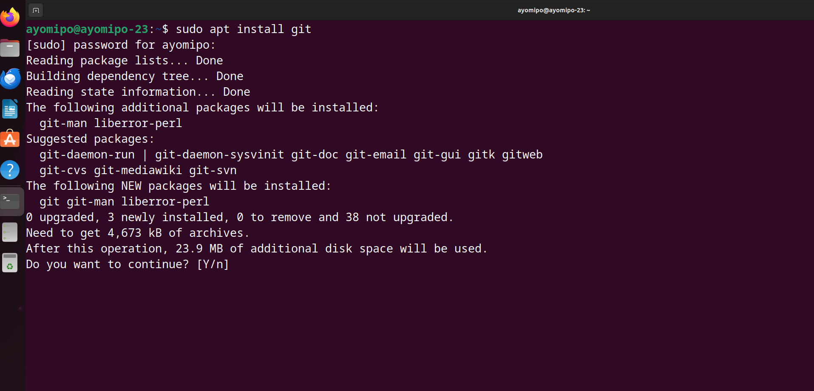
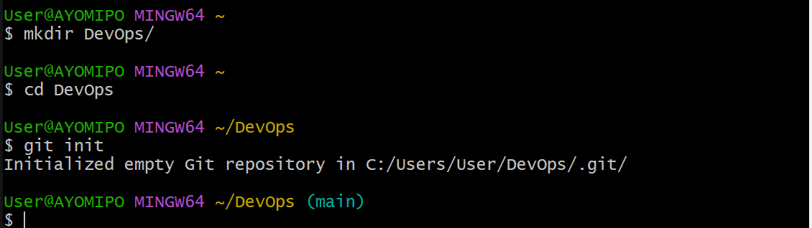

# **Git**

## Introduction to Git

**What is Git?**
Git is a *distributed* version control system (DVCS) that is widely used for tracking changes in source code during software development. It allows multiple developers to collaborate on projects, managing their work, and tracking changes over time. Developed by Linus Torvalds in 2005, Git has become one of the most popular version control systems in use today.
*Git is open source because its source code is made freely available for anyone to modify and use, aside from its creator. Open-source projects are built and maintained collectively by different developers in different locations.*


**Essential Functions of Git**

Git is of paramount importance in modern software development and collaborative projects. Its significance arises from various features and capabilities that address challenges inherent in version control and team collaboration. Here are key reasons why Git is crucial:

`Version Control`:
- Change Tracking: Git provides a systematic way to track changes made to source code and other files over time. Developers can easily review, compare, and revert changes, ensuring a comprehensive version history.
- Commit History: The detailed commit history helps developers understand the evolution of the codebase, providing insights into who made changes, when, and the reasons behind those changes.

`Collaborative Development`:
- Branching and Merging: Git's robust branching and merging capabilities allow multiple developers to work simultaneously on different features or bug fixes without interfering with each other's work. Changes can be later integrated into the main codebase.
- Pull Requests: Git hosting platforms, like GitHub and GitLab, leverage pull requests as a way for developers to propose and review changes before merging them into the main branch. This facilitates collaboration and code review.

`Flexible Workflows`:
- Workflow Support: Git accommodates various development workflows, allowing teams to choose a process that best fits their project requirements. Common workflows include feature branching, Gitflow, and GitHub flow.
- Custom Hooks: Git's support for custom hooks allows developers to automate tasks or enforce specific policies at different stages of the version control workflow.

`Decentralization and Offline Work`:
- Distributed System: Git is a distributed version control system, meaning that each developer has a complete copy of the project's history. This decentralization supports offline work and collaboration without a continuous network connection.
- Standalone Operations: Developers can perform most Git operations locally, reducing dependency on a central server and increasing flexibility.

`Staging Area and Selective Commits`:
- Staging Changes: Git's staging area allows developers to selectively stage changes before committing. This enables more fine-grained control over versioning and allows for the separation of logical changes.

`Speed and Efficiency`:
- Local Operations: Many Git operations are performed locally, making them fast and efficient. This contributes to quicker development processes and faster responses during version control activities.

`Open Source and Community Support`:
- Community Development: Git is an open-source project with a large and active community. This community contributes to ongoing development, provides support, and shares best practices.

`Security and Integrity`:
- Immutable Commits: Once a commit is made, it is immutable and cannot be changed. This ensures the integrity of the version history and prevents accidental or malicious alterations.
- Cryptographic Hashing: Git uses SHA-1 hashing for object identifiers, providing a secure and tamper-evident mechanism for tracking changes.

`Adaptability and Extensibility`:
- Customization: Git is highly adaptable, allowing developers to customize their workflows, configuration settings, and even extend functionality using plugins and custom scripts.

`Portability`:
Cross-Platform Compatibility: Git is platform-agnostic and works seamlessly across different operating systems, including Windows, macOS, and Linux.


**Application of Git**

`Software Development`:
- Source Code Management (SCM): Git is primarily used for tracking changes in source code. It helps developers manage different versions of their codebase, track changes, and collaborate on software projects.
- Collaborative Development: Multiple developers can work on a project concurrently by using Git. Branching and merging features enable developers to work on isolated features or bug fixes and later integrate changes back into the main codebase.
- Code Review: Git hosting platforms like GitHub, GitLab, and Bitbucket facilitate code review through features like pull requests. Team members can review proposed changes, provide feedback, and ensure code quality before merging.

`Web Development`:
- Frontend and Backend Code: Web development projects, both on the frontend and backend, benefit from Git's version control capabilities. It allows for the management of HTML, CSS, JavaScript, server-side code, and other web development assets.
- Responsive Design: For responsive web design, Git helps manage different branches for various device resolutions, ensuring a consistent and responsive user experience.

`Mobile App Development`:
- iOS and Android Development: Git is widely used for version control in mobile app development, supporting both 
- iOS and Android platforms. It helps manage changes in code, resources, and configuration files.
- Collaboration in Mobile Teams: Teams working on mobile apps can use Git to collaborate efficiently, with each developer working on separate features or platforms.

`DevOps and Continuous Integration/Continuous Deployment (CI/CD)`:
- CI/CD Pipelines: Git integrates seamlessly with CI/CD tools to automate the building, testing, and deployment of software. Changes pushed to a Git repository trigger automated pipelines, ensuring rapid and reliable software delivery.
- Infrastructure as Code (IaC): Git is used to version control infrastructure code, allowing teams to manage and version infrastructure configurations. Tools like Terraform and Ansible are commonly integrated with Git.

`Data Science and Machine Learning`:
- Versioning Data and Notebooks: Data scientists use Git to version control datasets, Jupyter notebooks, and machine learning models. It helps track changes, collaborate with team members, and reproduce experiments.
- Experiment Tracking: Git enables the tracking of different experimental versions, making it easier to compare results, share findings, and reproduce experiments.

`Documentation`:
- Technical Documentation: Git is used to version control technical documentation. Teams can collaborate on documentation, track changes, and maintain a history of documentation edits.
- Wikis and Knowledge Bases: Git hosting platforms often include wikis that use Git repositories. This allows teams to collaboratively create and maintain knowledge bases.

`Game Development`:
- Versioning Game Assets: Git is utilized in game development to version control game assets, such as graphics, models, and scripts. Teams can work on different aspects of the game concurrently.
- Branching for Features: Game development teams often use Git branching to work on separate features, levels, or optimizations and later merge these changes into the main game code.

`Open Source Contributions`:
- Contributing to Projects: Open source projects often use Git to manage contributions from various contributors. Developers can fork repositories, make changes, and create pull requests to propose changes to the original project.
- Issue Tracking: Git hosting platforms provide issue tracking features, allowing contributors to report issues, suggest enhancements, and discuss development topics.


**Requirements in learning Git#**
- Get a good laptop
- Knowledge of linux and its command
- Download a an IDE or text editor e.g Vs code, Vim or nano.
- Download Git sofware and install on your operating system
- Create a Github account:[GitHub](https://github.com/signup?source=login)


## GIT INSTALLATION

### Windows:
- Git GUI (Graphical Interface):
Download the Git for Windows installer from the official Git website. Run the installer and follow the on-screen instructions.

 ### macOS:
-Homebrew (Package Manager):
Open the Terminal app.
Install Git using Homebrew by running the following command:
`brew install git` 

### Linux:
Debian/Ubuntu:
Open a terminal.
Run the following commands:
 ```
 sudo apt update
 sudo apt install git
```


### Checking the Installation:
After installation, you can verify that Git is installed by opening a terminal or command prompt and running the following command:
`git --version`


## Git commands
- git init: Initialize a new Git repository.
- git clone: Create a copy of a remote repository on your local machine.
- git add: Stage changes for the next commit.
- git commit: Record changes to the repository.
- git push: Push local changes to a remote repository.
- git pull: Fetch changes from a remote repository and merge them into the local branch.
- git branch: Create, list, or delete branches.
- git merge: Merge changes from one branch into another.


## Git concepts

i. ***Repositories***
```
mkdir DevOps
cd DevOps
git init
```



> This is simply saying:
-   create new folder/Directory
-   enter into the folder
-   initialize the folder into git repository


ii. ***First commit***
```
touch index.txt
echo "exited to make my first commit" >index.txt
git add .
git commit -m "initial commit"
```


>This is simply saying:
-  Create a text file in the current directory
-  Write any sentence of your choice inside the text file
-  Add your changes to git stagging
-  Commit your changes to git

iii. ***Working with Branches***

-  make a new branch
   
    `git checkout -b master`

-  list new branch
    
    `git branch`


-  revert back to old brnach
   
    `git checkout main(old)`


-   Merging a branch into another branch: running content of branch master into main
     
     `git merge main`


- Deleting a Git branch
  
   `git branch -d master`  

   


iv. ***Working with Remote Repositories for Collaboration***

### Collaboration in Git often involves the use of remote repositories. A remote repository is a version of your project hosted on a server or an online platform, allowing multiple developers to work together on the same codebase. Git hosting services like GitHub, GitLab, and Bitbucket are popular platforms for managing remote repositories. 


1. Creating a Git account:
kindly click [here](https://github.com/signup?source=login) account.


2. Creat A New Repository
-  Log in to your GitLab account.
-  Click on the "+" button in the top navigation bar and select "New project."
-  Fill in the project name, description, and other settings.
-  Click the "Create project" button.


3. Pushing your local Git Repository to your Remote Git Repository


- pushing the content to remote repository


4. Cloning Remote Git Repository
To clone a remote Git repository, you can use the git clone command. Here's the basic syntax:
`git clone <repository_url>`


## Introduction to mackdown synthax

Markdown is a lightweight markup language that is widely used for formatting text on platforms like GitHub, GitLab, and others. It provides a simple and readable way to write content without the need for complex HTML tags. *All the basic mackdown synthax were implemented in the README.md and GitConcepts.md content*


