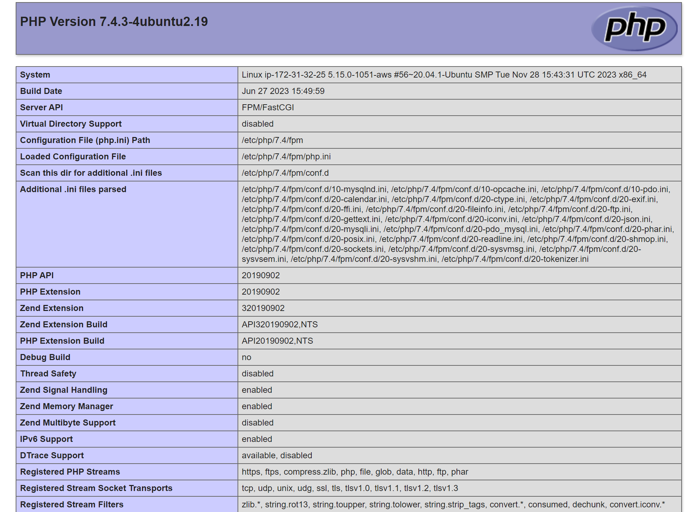

# **WEB STACK IMPLEMENTATION**

## Introduction to WEB STACK

### What is Web Stack?
> A web stack, also known as a web application stack or simply a web stack, refers to a set of software components or technologies used together to build and run web applications. A typical web stack consists of several layers, each serving a specific purpose in the development and operation of web applications.

**Types Of Web Stack**

1. LAMP Stack:

    -  Components: Linux (Operating System),Apache (Web Server), MySQL (Database), PHP/Python/Perl,
      (Server-Side  Scripting)

    -  Use Cases: Traditional and dynamic web applications.

2. MEAN Stack:

    -  Components: MongoDB (NoSQL Database), Express.js (Web Application Framework), Angular (Front-End Framework), Node.js (JavaScript Runtime for Server-Side)
 
    -  Use Cases: Real-time applications, single-page applications (SPAs).

3. MERN Stack:

    -  Components: MongoDB (NoSQL Database), Express.js (Web Application Framework), 
     React.js (Front-End Library), Node.js (JavaScript Runtime for Server-Side)

    -  Use Cases:Modern web applications, SPAs.

4. MEVN Stack:

    -  Components: MongoDB (NoSQL Database), Express.js (Web Application Framework), 
     Vue.js (Front-End Framework), Node.js (JavaScript Runtime for Server-Side)

    v-  Use Cases: Modern web applications, SPAs.

  ## `LAMP STACK`

  The LAMP stack, which stands for *Linux, Apache, MySQL, and PHP/Python/Perl*, is a popular open-source software stack used for web development. Each component of the stack serves a specific purpose, and together they provide a powerful environment for building and deploying dynamic web applications.

  > Here are the essential functions of each component in the LAMP stack:

  1. **Linux (Operating System)**:

    - Function: Provides the foundational operating system for the entire stack.

    - Key Features:
   
        *Stability*: Linux is known for its stability and reliability.
   
        *Security*: Linux offers robust security features, including user permissions and firewall capabilities.
  
        *Open Source*: Linux is open-source and allows for customization and optimization.

2. **Apache (Web Server)**:

    - Function: Serves as the web server to handle HTTP requests and deliver web content to clients.

    - Key Features:
   
        *HTTP Server*: Apache is a widely-used HTTP server that supports the HTTP and HTTPS protocols.
   
        *Virtual Hosting*: Allows hosting multiple websites on a single server.
   
        *Modules*: Apache supports modules for extending functionality, such as mod_rewrite for URL rewriting.

3. **MySQL (Database Management System)**:

    - Function: Manages and stores data in a relational database.

    - Key Features:
   
        *Relational Database*: MySQL is a relational database management system (RDBMS).
   
        *SQL Support*: Supports the Structured Query Language (SQL) for database operations.
   
        *ACID Compliance*: Ensures data integrity through Atomicity, Consistency, Isolation, and Durability.

4. **PHP/Python/Perl (Scripting/Programming Language)**:

    - Function: Handles server-side scripting for dynamic content generation.

    - Key Features:
   
        *Server-Side Scripting*: Enables the execution of scripts on the server to generate dynamic web content.
   
        *Integration*: PHP, Python, or Perl are integrated with HTML to create dynamic web pages.
   
        *Extensibility*: Supports the use of additional libraries and frameworks for web development.   

### `Application Of LEMP STACK`

    1. Web Development
    2. Content Management Systems (CMS)
    3. E-Commerce Platforms
    4. Customer Relationship Management (CRM) Systems
    5. Financial Services Applications
    6. Healthcare Applications

### `Requirements in learning a LEMP STACK`

1.  Open AWS account. [CLICK HERE](https://portal.aws.amazon.com/billing/signup#/start/email) to create one.
    
2.  Good knowledge of Linux
    
3.  Understand ssh kegs. click on this link to learn more on [SSH](https://www.digitalocean.com/community/tutorials/how-to-set-up-ssh-keys-on-ubuntu-20-04)

## **GETTING STATED WITH LEMP STACK**

    1. **Launch an Ubuntu Instance on AWS Console and SSH Into From Your Terminal**

> [!Note]
 >Be sure to launch an Ubuntu 20.04LTS instance. Also keep your .pem key safely. Once it is lost, you will not be able to ssh into the instance again. Also, anyone with the key can have access to your instance.

### *ssh into your ubuntu Ec2 instance*
    
    ssh -i path/to/.pem ubuntu@public_ip_address
    

    2. **Installing Nginx** 
    
### *Update Local Packages list*

    sudo apt update

### *Install Nginx web server*

    sudo apt Nginx install

### *Allow firewall for apache*

    sudo ufw allow 'Nginx HTTP'
    sudo ufw allow 22

### *Confirm Nginx web server is sucessfully installed*

    sudo systemctl status nginx

    3. **Installing Mysql**
`   mysql will be installed as a database to store data for our web application`

        $ sudo apt install mysql-server

    Log into mysql console as the root user

        sudo mysql

    Setting up root password for root user using mysql native password

`ALTER USER 'root'@'localhost' IDENTIFIED WITH mysql_native_password BY 'PassWord.1';`

    Exit Mysql shell

`   Exit`

    Run iteractive script to secure the data base

     $ sudo mysql_secure_installation

     This will ask if you want to configure the VALIDATE PASSWORD PLUGIN, After the validation is completed, login to MYSQL and input the password by adding the -p flag.

        sudo mysql -p

After succcessful password validation and confimation of login, you can exit MYSQL

`   Exit`

    4. **Installing php**

 *We need to install php-fpm, which stands for “PHP fastCGI process manager”, and tell Nginx to pass PHP requests to this software for processing. Additionally, we need php-mysql, a PHP module that allows PHP to communicate with MySQL-based databases. Core PHP packages will automatically be installed as dependencies.*

    sudo apt install php-fpm php-mysql -y

`   Configuring Nginx to Use PHP Processor`

- To configure Nginx to use PHP as a processor, you need to set up the FastCGI process manager (PHP-FPM) and configure Nginx to pass PHP requests to PHP-FPM.

- We will create a folder called projectLEMP for our webserver. Create the root web directory for your_domain in /var/www/ folder as follows:

     sudo mkdir /var/www/projectLEMP
- Next, assign ownership of the directory with the $USER environment variable, which will reference your current system user:

     $ sudo chown -R $USER:$USER /var/www/projectLEMP

- Open a new configuration file in Nginx’s sites-available directory

    $ sudo nano /etc/nginx/sites-available/projectLEMP

After editing, save and close the file. If you’re using nano, you can do so by typing CTRL+X and then y and ENTER to confirm.

- Lets activate the configuration by linking the config file from Nginx’s sites-enabled directory, This will tell Nginx to use the configuration next time it is reloaded:

    $ sudo ln -s /etc/nginx/sites-available/projectLEMP /etc/nginx/sites-enabled/

- Let's test the configuration is working.

    sudo nginx -t

- We need to disable default Nginx host that is currently configured to listen on port 80, for this run:

    sudo unlink /etc/nginx/sites-enabled/default

- Let's reload NGINX to apply these changes.

    sudo systemctl reload nginx

- Create an index.html file in the location /var/www/projectLEMP so that we can test that your new server block works as expected:

    sudo echo 'Hello LEMP from hostname' $(curl -s http://169.254.169.254/latest/meta-data/public-hostname) 'with public IP' $(curl -s http://169.254.169.254/latest/meta-data/public-ipv4) > /var/www/projectLEMP/index.html

- Now let's try to open your website URL from the browser using IP address or DNS name:

    http://<Public-IP-Address>:80 or http://<Public-DNS-Name>:80

**The LEMP stack is now fully configured. In the next step, we’ll create a PHP script to test that Nginx is in fact able to handle .php files within our newly configured website.**

`   Testing Nginx With PHP`

- we can do this by creating a test PHP file in our document root. let's open a new file called info.php:

- we can now access this page in the web browser by visiting the domain name or public IP address set up in the Nginx configuration file, followed by /info.php:

    http://server_domain_or_IP/info.php

    

