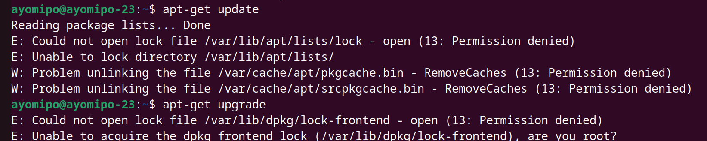

# `apt-get` command

## apt-get is a package management tool used in Debian-based Linux distributions, including Ubuntu. It is part of the Advanced Package Tool (APT) system and is used for installing, upgrading, and managing software packages on a Linux system. 

