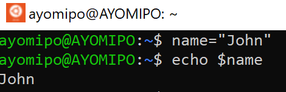
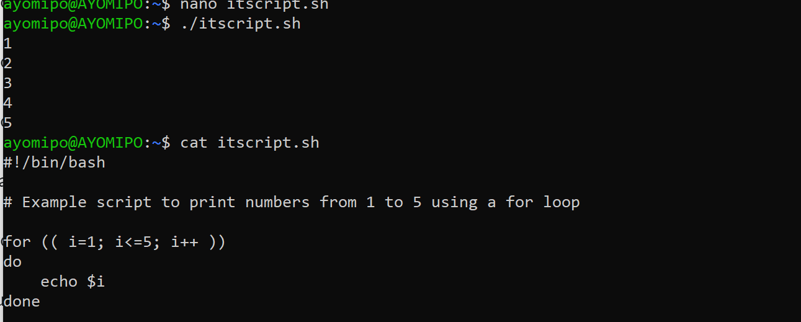
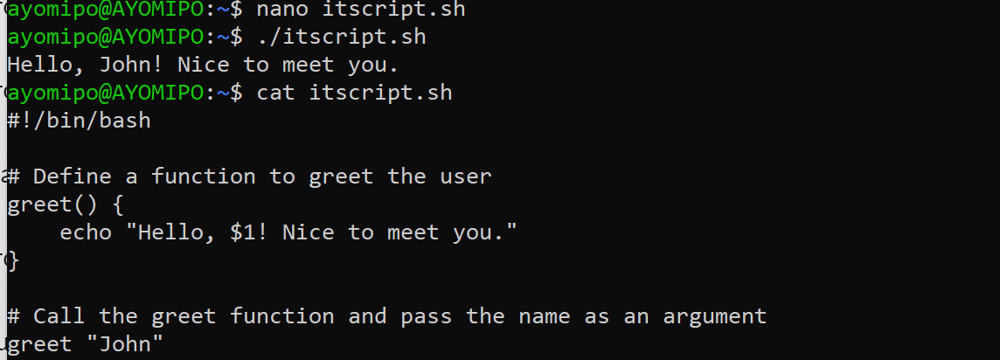
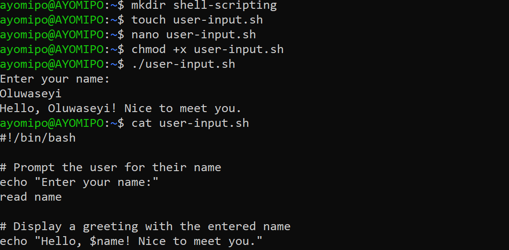
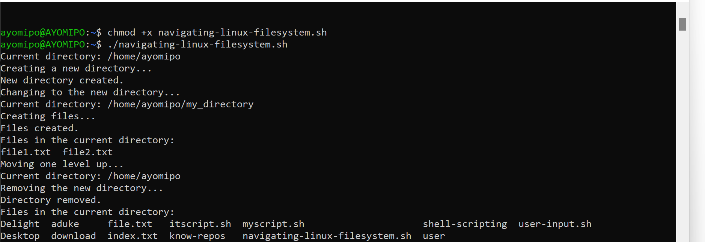
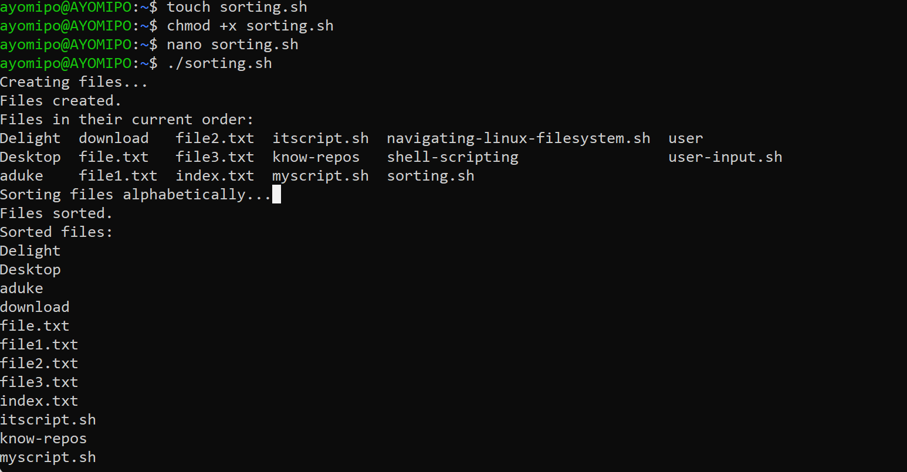
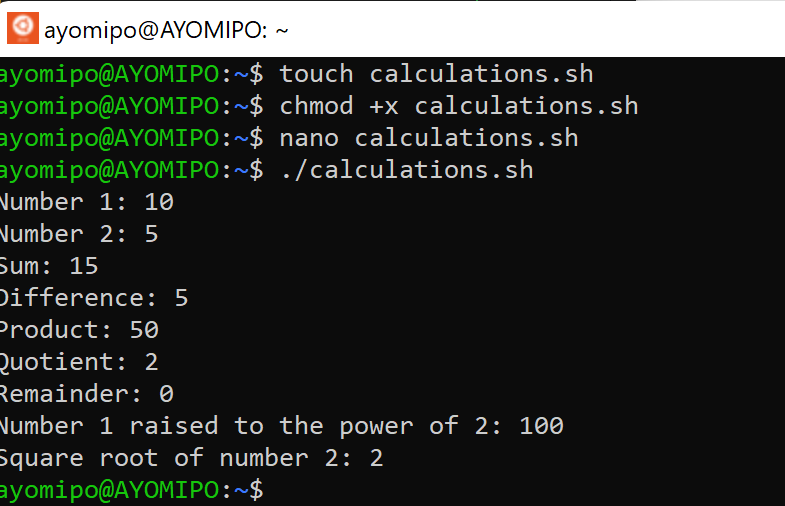
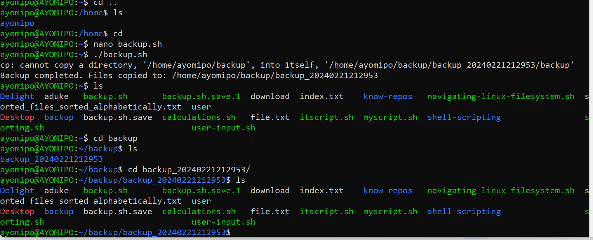

# `Shell Scripting`

## Introduction to shell scripting

### What is shell scripting?
> Shell scripting is a form of programming or scripting that involves writing a series of commands for a command-line interpreter, or shell, to execute. A shell is a user interface that allows users to interact with the operating system by entering commands. Shell scripts are essentially text files containing a sequence of such commands that can be executed together as a single program.

**Key Aspects of Shell Scripting**

1.  *Interactivity*: Shells provide an interactive environment where users can enter commands and receive immediate feedback. Shell scripts allow users to automate sequences of these commands.

2. *Scripting Language*: Shell scripts are typically written in scripting languages specific to the shell environment. For example, Bash (Bourne Again SHell) is a popular scripting language for Unix-like operating systems, while PowerShell is commonly used in Windows environments.

3. *Automation*: The primary purpose of shell scripting is automation. Users can create scripts to perform repetitive tasks, execute multiple commands in sequence, or automate system administration tasks.

4. *Control Structures*: Shell scripts support control structures such as loops, conditionals, and functions, allowing for more complex and dynamic behavior. This enables scriptwriters to make decisions and repeat actions based on certain conditions.

5. *Variables and Environment*: Shell scripts can use variables to store and manipulate data, making it possible to create dynamic and adaptable scripts. They also interact with the environment, using environment variables for configuration and communication with other processes.

6. *File Handling*: Shell scripts can manipulate files and directories, perform file operations, and handle input/output operations. This is crucial for tasks like data processing, file manipulation, and system configuration.

**Commonly Use Shell for Scripting**
- Commonly used shells for scripting include Bash, sh (Bourne Shell), csh (C Shell), ksh (Korn Shell), and PowerShell (for Windows). The choice of shell depends on the specific requirements of the task, as well as the operating system environment in use.

**Target Audience**

i. DevOps Engineers: DevOps professionals need to know shell scripting to create and manage automation scripts in CI/CD pipelines, container orchestration, and infrastructure as code (IaC) practices.

ii. System administrators need to learn shell scripting in order to make their jobs easier. Shell scripting helps them automate repetitive tasks, control servers, and guarantee that the system is secure and running smoothly.

iii. QA Engineers can use shell scripting to make testing easier and faster, which means they don't have to do as much testing by hand.

iv. IT support and operations teams utilize shell scripting to fix problems, keep an eye on systems, and do regular maintenance to make sure the systems work at their best.

## **Getting Started With Shell Scripting**

### Shell Scripting syntax Element

1. Variables: are used to store and manipulate data. They are assigned values using the '=' operator, and the value is accessed using $variable_name.

2. Shebang:The shebang at the beginning of a script specifies the path to the shell that should be used to interpret the script. In this case, it indicates that the Bash shell should be used.

    #!/bin/bash

3.  Comments: Lines beginning with the '#' character are comments and are ignored by the shell. Comments are used to add explanations and annotations to the script for human readers.

    > This is a comment

4.  Command Execution:This allows you to capture the output of a command and store it in a variable. The $(command) syntax is used for command substitution.

    result=$(command)

5.  Control Flow

    a. Conditionals: Conditional statements allow you to execute different blocks of code based on specified conditions. Square brackets are used for testing conditions.

        if [ condition ]; then
         # commands
        elif [ another_condition ]; then
            # commands
        else
            # commands
        fi

    

    b. Loops: Loops allow you to repeat a block of code. for loops iterate over a list of items, while while loops continue executing as long as a specified condition is true.

        for item in list; do
          # commands
        done

        while [ condition ]; do
            # commands
        done

6.  Command Subsitution:  This feature is useful when you want to capture the result of a command and use it as part of another command or in a variable assignment.

    
7.  Input and Output: n Bash, input and output are handled through various mechanisms, including command-line arguments, standard input (stdin), standard output (stdout), and standard error (stderr)

8.  Functions: Functions allow you to encapsulate a block of code that can be reused. Functions are defined using the function_name() { ... } syntax.

    function_name() {
        # commands
    }

        # Call the function
    function_name

### Working With Shell Scripting

    #!/bin/bash

    # Prompt the user for their name
    echo "Enter your name:"
    read name

    # Display a greeting with the entered name
    echo "Hello, $name! Nice to meet you."

### Direct Manipulation and Navigation

    #!/bin/bash

    # Display current directory
    echo "Current directory: $PWD"

    # Create a new directory
    echo "Creating a new directory..."
    mkdir my_directory
    echo "New directory created."

    # Change to the new directory
    echo "Changing to the new directory..."
    cd my_directory
    echo "Current directory: $PWD"

    # Create some files
    echo "Creating files..."
    touch file1.txt
    touch file2.txt
    echo "Files created."

    # List the files in the current directory
    echo "Files in the current directory:"
    ls

    # Move one level up
    echo "Moving one level up..."
    cd ..
    echo "Current directory: $PWD"

    # Remove the new directory and its contents
    echo "Removing the new directory..."
    rm -rf my_directory
    echo "Directory removed."

    # List the files in the current directory again
    echo "Files in the current directory:"
    ls

- Output:

### File Operation and Sorting

    #!/bin/bash

    # Create three files
    echo "Creating files..."
    echo "This is file3." > file3.txt
    echo "This is file1." > file1.txt
    echo "This is file2." > file2.txt
    echo "Files created."

    # Display the files in their current order
    echo "Files in their current order:"
    ls

    # Sort the files alphabetically
    echo "Sorting files alphabetically..."
    ls | sort > sorted_files.txt
    echo "Files sorted."

    # Display the sorted files
    echo "Sorted files:"
    cat sorted_files.txt

    # Remove the original files
    echo "Removing original files..."
    rm file1.txt file2.txt file3.txt
    echo "Original files removed."

    # Rename the sorted file to a more descriptive name
    echo "Renaming sorted file..."
    mv sorted_files.txt sorted_files_sorted_alphabetically.txt
    echo "File renamed."

    # Display the final sorted file
    echo "Final sorted file:"
    cat sorted_files_sorted_alphabetically.txt

### Working With Numbers and Calculations

    #!/bin/bash

    # Define two variables with numeric values
    num1=10
    num2=5

    # Perform basic arithmetic operations
    sum=$((num1 + num2))
    difference=$((num1 - num2))
    product=$((num1 * num2))
    quotient=$((num1 / num2))
    remainder=$((num1 % num2))

    # Display the results
    echo "Number 1: $num1"
    echo "Number 2: $num2"
    echo "Sum: $sum"
    echo "Difference: $difference"
    echo "Product: $product"
    echo "Quotient: $quotient"
    echo "Remainder: $remainder"

    # Perform some more complex calculations
    power_of_2=$((num1 ** 2))
    square_root=$(echo "sqrt($num2)" | bc)

    # Display the results
    echo "Number 1 raised to the power of 2: $power_of_2"
    echo "Square root of number 2: $square_root"

    

### File Backup and Timestamping

    #!/bin/bash

    # Define the source directory and backup directory
    source_dir="/path/to/source_directory"
    backup_dir="/path/to/backup_directory"

    # Create a timestamp with the current date and time
    timestamp=$(date +"%Y%m%d%H%M%S")

    # Create a backup directory with the timestamp
    backup_dir_with_timestamp="$backup_dir/backup_$timestamp"

    # Create the backup directory
    mkdir -p "$backup_dir_with_timestamp"

    # Copy all files from the source directory to the backup directory
    cp -r "$source_dir"/* "$backup_dir_with_timestamp"

    # Display a message indicating the backup process is complete
    echo "Backup completed. Files copied to:        $backup_dir_with_timestamp"

> Output:

***Thank you***