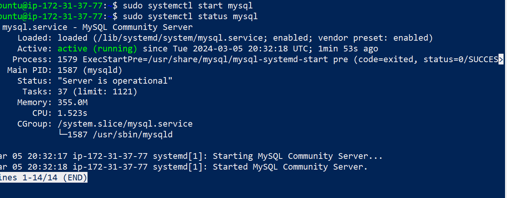
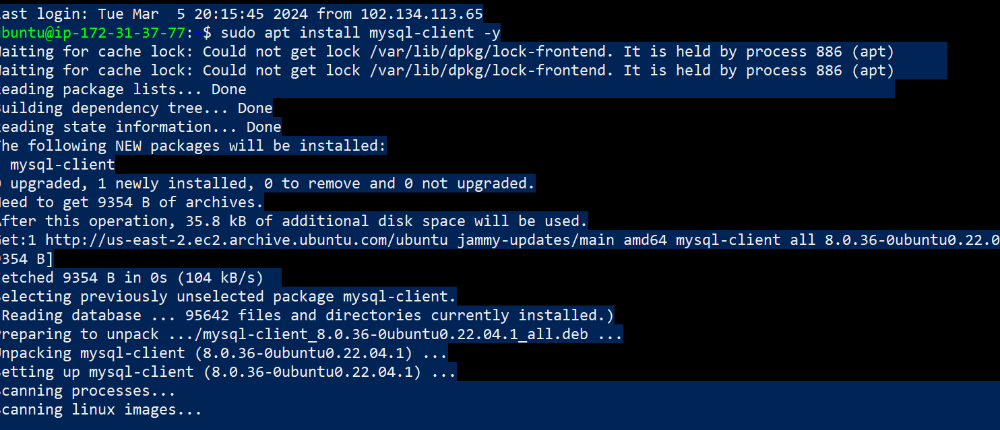
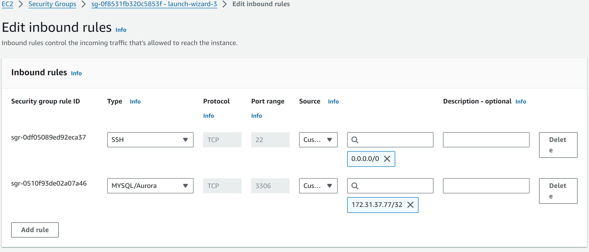
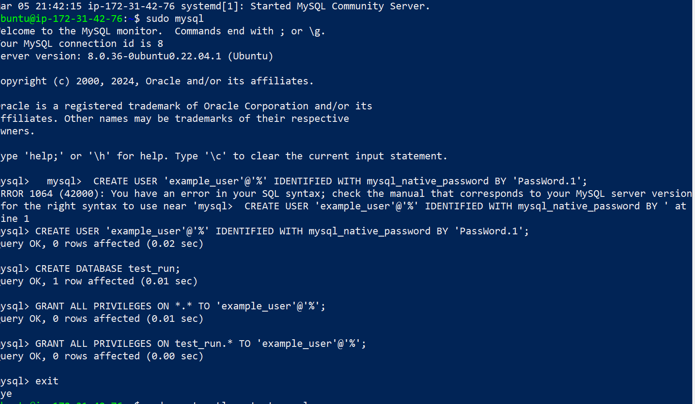

# **Understanding Client Server Architecture With MySQL As RDBMS**

## **Introduction**

Client-Server architecture is a computing model that divides the functionality of a system into two distinct roles: clients and servers. In this architecture, clients make requests for services or resources, and servers provide those services or resources. MySQL, as a Relational Database Management System (RDBMS), is often used in a client-server architecture for managing and storing data.

### Here's a high-level overview of how this architecture works with MySQL:

Components:
1. Client:
The client is the end-user device or application that initiates requests to the server. Clients can be various types, such as desktop applications, web browsers, mobile apps, or other devices that need access to data stored in the MySQL database.

2. Server:
The server hosts the MySQL database and handles client requests. It is responsible for processing queries, managing data, and responding to client requests for information.

3.  MySQL Database:
MySQL is an RDBMS that manages and organizes data in a structured manner. It stores data in tables, enforces relationships between tables, and provides a SQL (Structured Query Language) interface for interacting with the data.

Workflow:

1. Client Request:
The client initiates a request by sending a query or a command to the server. This request could be a SQL query for data retrieval, insertion, updating, or deletion.

2. Server Processing:
The server receives the client's request and processes it. For example, if the request is a SELECT query, the server fetches the requested data from the MySQL database. If it's an INSERT or UPDATE, the server modifies the data accordingly.

3.  Database Interaction:
The MySQL database manages data storage, retrieval, and manipulation. It executes the SQL queries received from the server and returns the results. The database ensures data integrity, enforces relationships, and performs various optimizations for efficient data handling.

4.  Response to Client:
The server sends the results of the query or the status of the operation back to the client. This could be the requested data, a success message, or an error message, depending on the nature of the client's request.

### `Clent Server Achitecture with Mysql`

MySQL is a relational database management system (RDBMS) developed by Oracle that is based on structured query language (SQL). Asw a devops engineer, a knowledge of a RDMS such as [MySQL](https://en.wikipedia.org/wiki/MySQL) is needed.

Now that we have an understanding of a client server architecture, a client server architecture with mysql means using mysql as a client as well as a server.

In some of our previous projects like LAMP and LEMP stack, we implemented, a client server architecture wherby our webserver is a client such that it sends a request to our database server to get a response (data). The architecture is shown inthe image below

### Why is a Client Server Architecture With MySQL Important?

- *Scalability*:
    Multiple clients can connect to the server simultaneously, making it scalable. Additional servers can be added to handle increased demand, and load balancing can be implemented for optimal performance.

- *Security*:
    Security measures are implemented at both the client and server levels. Clients authenticate themselves to the server, and the server enforces access controls to protect the data stored in the MySQL database.

- *Concurrent Access*:
    Multiple clients can interact with the server concurrently. The server manages concurrency to ensure data consistency and integrity.

- *Centralized Data Management*:
    MySQL provides a centralized and organized way to manage data. The server is responsible for centralized data storage, retrieval, and manipulation.

- *Data Consistency*:
    Because the server manages all data operations, data consistency is maintained. All clients access the same data, ensuring a consistent view of information.

#### A Quick example of client serve communication is shown below:

    $ curl -Iv www.propitixhomes.com

- ubuntu terminal serve as the CLIENT while www.propitxhomes will be the SERVER

 

## **Implementing MySQL as a Client Server Architecture**

Step 1: Launch 2 EC2 Instances on AWS
i. Each instance should be named

    Instance 1 - mysql server

    Instance 2 - mysql client

ii. Open 2 terminals and ssh into both "mysql server" "mysql client"

Step 2: Updating and Upgrading Package Lists and Apt Repositories
    On both mysql server and mysql client update and upgrade package lists

    sudo apt update -y && sudo apt upgrade -y
Note: The command above should be executed for mysql server and mysql client instances

Step 3: Installing MySQL Server Software

    sudo apt install mysql-server -y

To start mysql service

    sudo systemctl start mysql

Check is mysql is active and running

    sudo systemctl status mysql

Step 4: Installing MySQL Client Sofware

On mysql client instance install MySQL Client software.

sudo apt install mysql-client -y

Step 4: Allowing Access To MySQL Server for MySQl Client
- By default, both of your EC2 virtual servers are located in the same local virtual network, so they can communicate to each other using local IP addresses. Or, you can add them to the same subnets.

Use mysql server's local IP address to connect from mysql client. MySQL server uses TCP port 3306 by default, so you will have to open it by creating a new entry in ‘Inbound rules’ in ‘mysql server’ Security Groups. For extra security, do not allow all IP addresses to reach your ‘mysql server’ – allow access only to the specific local IP address of your ‘mysql client’.

Step 5: Create A New User and Database On MySQL Server
In order for mysql client to be able to send request to mysql server, we need to create a new user for mysql client and a database.

i. Login to mysql server

    sudo mysql

ii. Create a new user

    mysql>  CREATE USER 'example_user'@'%' IDENTIFIED WITH mysql_native_password BY 'PassWord.1';

Note: The password field should be replaced wih your password

iii. Create a database

    CREATE DATABASE example_database;

Step 6: Grant MySQL Client Administrative Prilvledges

i. Grant privileges

      mysql> GRANT ALL ON example_database.* TO 'example_user'@'%';

Exit MySQL and restart the mySQL service using

    sudo systemctl restart mysql

