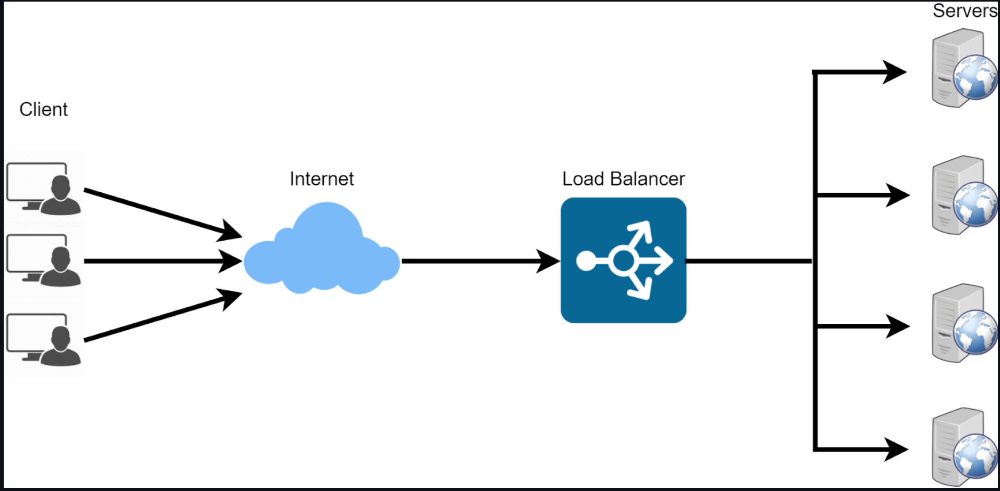

# **Implememting Load Balancers With Nginx**

## **Introduction**

- Imagine you have a popular ice cream shop with a single cashier. As more and more people line up to buy ice cream, the cashier gets busier, and the line gets longer. Customers might get frustrated waiting for a long time, and the cashier might feel overwhelmed.

Now, let's introduce a load balancer into this scenario. The load balancer is like a helpful assistant who notices the long line and decides to bring in more cashiers to help. Each cashier can take orders independently, making the process much faster.

So, a load balancer is like a smart organizer that makes sure the workload is spread evenly among multiple servers, making the whole system more efficient and responsive, just like having multiple cashiers to serve customers quickly at an ice cream shop.

### `What is Load Balancer?`

A load balancer is a network device or software application that efficiently distributes incoming network traffic across multiple servers. The primary purpose of a load balancer is to enhance the availability and reliability of applications by ensuring that no single server is overwhelmed with too much traffic, thus distributing the load across multiple servers.

- The image above show multiple client making request to a load balancer. The load balancer, make a request to a web server and gets a response then give the response back to the client. If the web server not available due to certain reasons which can either be that the server is down or cannot or cannot handle more requests, the load balancer will direct the client response to another server and give response back to the client.

### key features and benefits of load balancers

1. *Distribution of Traffic*:

Load balancers distribute incoming requests or network traffic across multiple servers to prevent overloading any single server. This ensures that each server shares the load and can handle a portion of the requests.

2. *Improved Scalability*:

Load balancing allows organizations to scale their applications horizontally by adding more servers to the server pool. This makes it easier to handle increased traffic and ensures that the application remains responsive.

3. *Enhanced Availability and Redundancy*:

Load balancers can route traffic away from servers that are experiencing issues or are unavailable. This improves the overall availability of the application and provides a level of redundancy.

4. *Session Persistence*:

Some load balancers can maintain session persistence, ensuring that a user's requests are consistently directed to the same server. This is important for applications that require continuity, such as those with user login sessions.

5. *SSL Termination*:

Load balancers can handle SSL/TLS termination, offloading the encryption and decryption process from the application servers. This helps improve performance and simplifies the management of SSL certificates.