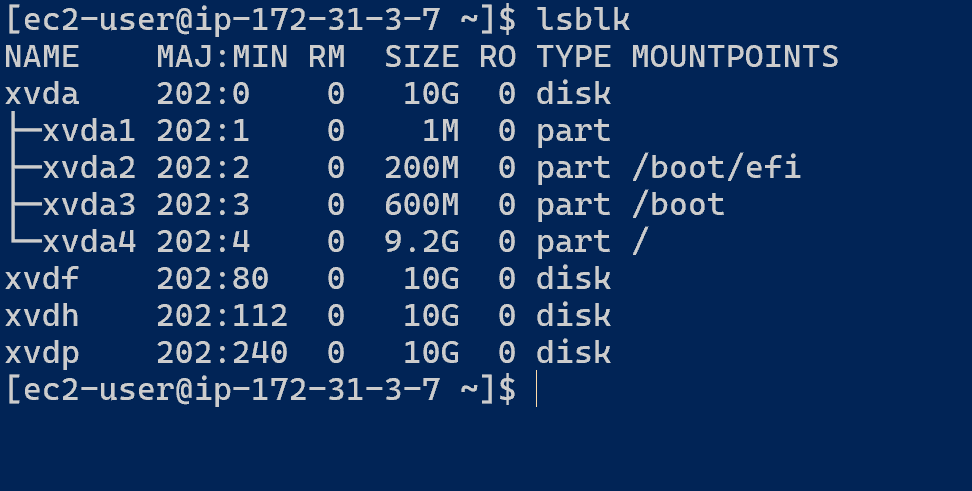
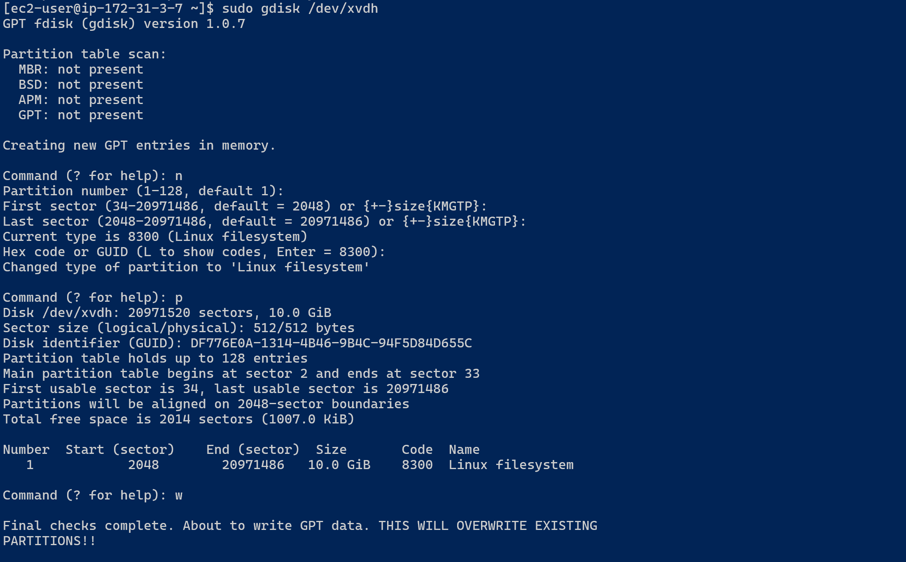
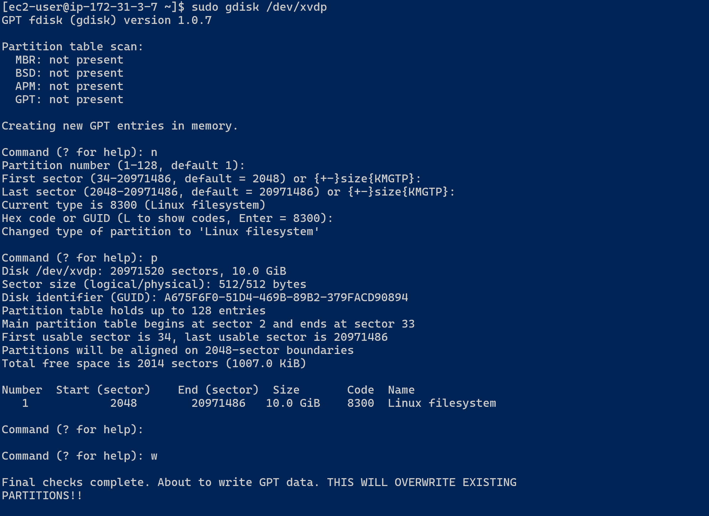
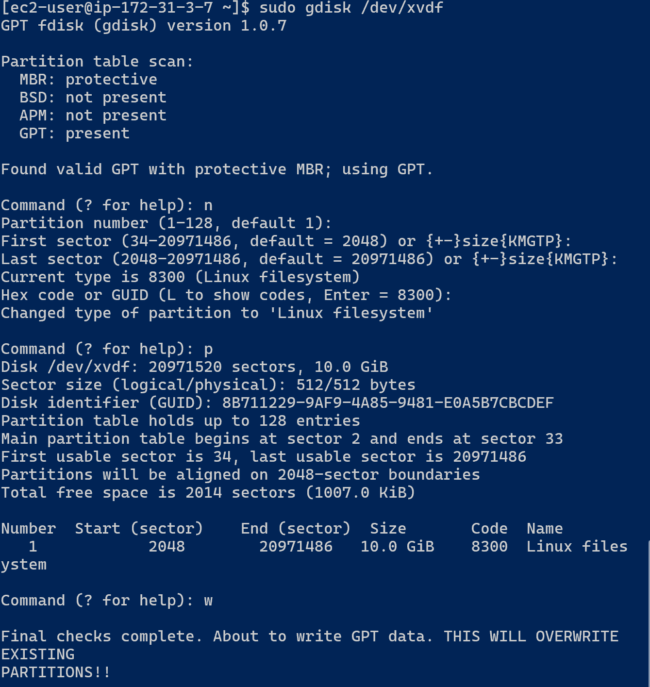
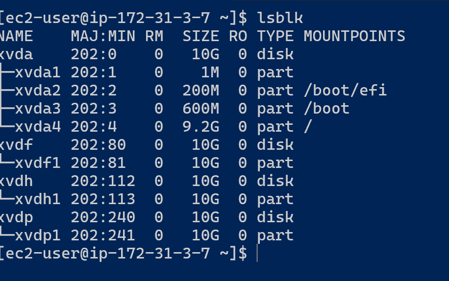
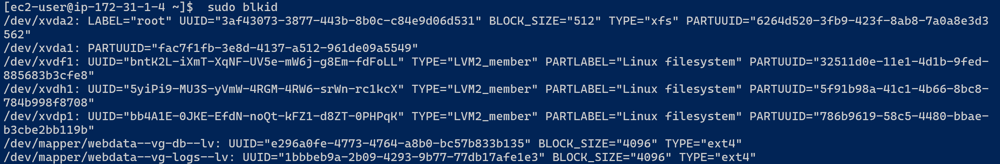

# Implementing Wordpress Website With LVM Storage Management

## Introduction
Certainly! WordPress is a popular open-source content management system (CMS) and website creation tool written in PHP. It is widely used for building websites, blogs, and online stores due to its flexibility, ease of use, and extensive ecosystem of themes and plugins.

### What Is LVM Storage?

- LVM stands for Logical Volume Manager, which is a technology used on Linux systems to manage storage devices and provide advanced features for managing disk space, such as logical volumes, snapshots, and volume resizing. LVM allows for more flexible and dynamic management of disk partitions compared to traditional partitioning schemes. 
- LVM provides a flexible and efficient way to manage storage resources on Linux systems, offering advanced features that enhance data management and system flexibility. It is particularly useful in environments where storage requirements are dynamic and may change over time.

**Key Components of LVM**:

1. Physical Volumes (PVs):These are physical storage devices (e.g., hard drives, SSDs) or partitions that are initialized for use with LVM. Each physical volume is assigned a unique identifier.

2. Volume Groups (VGs):These are created by combining one or more physical volumes. A volume group represents a pool of storage that can be divided into logical volumes.

3. Logical Volumes (LVs):These are virtual partitions created from free space within volume groups. They can be thought of as equivalent to partitions in traditional disk partitioning schemes (e.g., ext4 partitions). Logical volumes can be resized dynamically without requiring downtime.

**Advantages of LVM**:

Flexibility: LVM allows administrators to resize logical volumes dynamically, enabling easy allocation and reallocation of disk space without the need to repartition disks.

Volume Management: LVM simplifies storage management by abstracting physical storage devices into logical volumes, providing a unified view of storage across multiple disks.

Snapshots: LVM supports creating snapshots, which are read-only copies of a logical volume at a specific point in time. Snapshots are useful for backups and testing without affecting the original data.

Striping and Mirroring: LVM supports RAID-like functionality such as striping (to improve performance) and mirroring (to provide data redundancy) at the volume group level.

**Common LVM Commands**:

pvcreate: Initializes a physical volume for use with LVM.
vgcreate: Creates a volume group by combining one or more physical volumes.
lvcreate: Creates a logical volume within a volume group.
lvresize: Resizes an existing logical volume.
lvextend / lvreduce: Extends or reduces the size of a logical volume.
lvdisplay: Displays information about logical volumes.

**Use Cases for LVM**:

1. Server Virtualization: LVM is commonly used in virtualization environments to manage disk resources for virtual machines.

2. Database Servers: LVM allows for easy resizing of partitions used by databases to accommodate changing storage requirements.

3. Backup Systems: LVM snapshots can be used for creating consistent backups of data without interrupting ongoing operations.

## Implementing Wordpress Web Solution
Three-tier Architecture Generally, web, or mobile solutions are implemented based on what is called the Three-tier Architecture.

Three-tier Architecture is a client-server software architecture pattern that comprise of 3 separate layers.

Your 3-Tier Setup

- A Laptop or PC to serve as a client
- An EC2 Linux Server as a web server (This is where you will install WordPress)
- An EC2 Linux server as a database (DB) serve

1. Create an AWS instance using RedHat Distribution
    
    The EC2 instance will serve as a Web Server, create 3 volumes in the same AZ as the Web Srver EC2, each of 10GB.

2. Attach the three volumes one by one to your Webserver EC2 instance

   

3. Open up the Linux terminal to begin configuration

4. Use lsblk command to inspect what block devices are attached to the server. Notice names of your newly created devices. All devices in Linux reside in /dev/ directory. Inspect it with ls /dev/ and make sure you see all 3 newly created block devices there – their names will likely be xvdf, xvdh, xvdp.

          

5. Use df -h command to see all mounts and free space on your server

6. Use gdisk utility to create a single partition on each of the 3 disks

    sudo gdisk /dev/xvdf

        

7. Use lsblk utility to view the newly configured partition on each of the 3 disks.

8. Install lvm2 package using sudo yum install lvm2. Run sudo lvmdiskscan command to check for available partitions.

     

9. Use pvcreate utility to mark each of 3 disks as physical volumes (PVs) to be used by LVM.

10. Use vgcreate utility to add all 3 PVs to a volume group (VG). Name the VG webdata-vg

    sudo vgcreate webdata-vg /dev/xvdh1 /dev/xvdg1 /dev/xvdf1

11. verify that VG has been created

12. Use lvcreate utility to create 2 logical volumes. apps-lv (Use half of the PV size), and logs-lv Use the remaining space of the PV size. NOTE: apps-lv will be used to store data for the Website while, logs-lv will be used to store data for logs.
    
sudo lvcreate -n apps-lv -L 14G webdata-vg
sudo lvcreate -n logs-lv -L 14G webdata-vg

13. Verify that your Logical Volume has been created successfully by running sudo lvs

14. Verify the entire setup

       

15. Use mkfs.ext4 to format the logical volumes with ext4 filesystem
    
sudo mkfs -t ext4 /dev/webdata-vg/apps-lv
sudo mkfs -t ext4 /dev/webdata-vg/logs-lv

16. Create /var/www/html directory to store website files
    
sudo mkdir -p /var/www/html

17. Create /home/recovery/logs to store backup of log data

sudo mkdir -p /home/recovery/logs

18. Mount /var/www/html on apps-lv logical volume
    
sudo mount /dev/webdata-vg/apps-lv /var/www/html/

19. Use rsync utility to backup all the files in the log directory /var/log into /home/recovery/logs (This is required before mounting the file system)
    
sudo rsync -av /var/log/. /home/recovery/logs/

20. Mount /var/log on logs-lv logical volume. (Note that all the existing data on /var/log will be deleted. That is why step 15 above is very important)
    
sudo mount /dev/webdata-vg/logs-lv /var/log

21. Restore log files back into /var/log directory

sudo rsync -av /home/recovery/logs/. /var/log

22. UPDATE THE /ETC/FSTAB FILE

The UUID of the device will be used to update the /etc/fstab file;

    sudo blkid

    sudo nano /etc/fstab

Update /etc/fstab in this format using your own UUID and rememeber to remove the leading and ending quotes.

